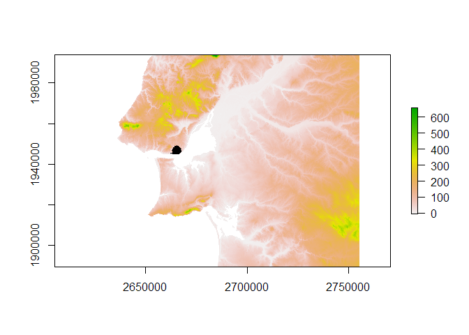
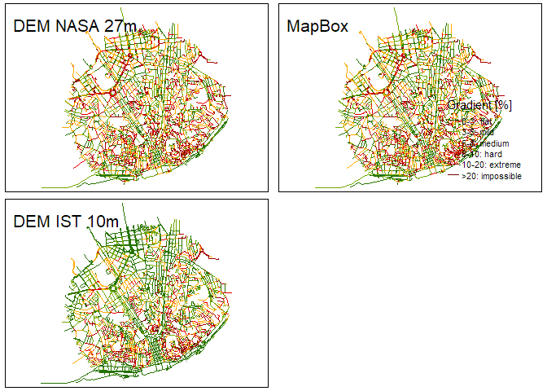

Benchmark Elevation Sources
================

## Intro

Different elevation sources may bring better or worse results, when
computing slopes for a road network.  
In many cases, the resolution of raster digital elevation models (DEM)
does not matter much, when we assume that they will be small enough for
large segments - for instance, if we need to know the gradient of a 2km
length highway, planned for motorized vehicles.  
But when physical effort matters, such as for active travel (walking,
cycling), a 50m road with a 2% gradient might be very different that an
8% gradient.  
For smaller road segments, getting an accurate gradient value might be
an issue, in particular when the free and open data sources do not
provide a good resolution.  
In this example, we will see and compare the results of [slopes R
package](https://github.com/ITSLeeds/slopes) for the same road network
sample (in Lisbon, Portugal), using three different elevation data
sources, with different resolution.

## Materials - Data sources

Open data sources

### For Elevation Models

-   NASA Digital Elevation Model, with 27m cell resolution
-   MapBox-Terrain tiles, with 0.1 meter height increments (ref)
-   Instituto Superior Técnico Digital Elevation Model, with 10m cell
    resolution

##### NASA DEM

The SRTM NASA’s mission Os dados do SRTM (Shuttle Radar Topography
Mission), uma missão da NASA, estão disponíveis gratuitamente, mas para
uma resolução de 25 a 30m, com erro da altimetria vertical de 16m -
saber mais. Para fazer donwload do tile correcto, pode-se também
recorrer a um outro plugin do QGIS, o SRTM-Donwloader, e pedir para
guardar o raster que cobre a shapefile da rede viária - é uma opção no
QGIS.

Como o raster cobre uma área bem maior do que necessitamos (ver ficheiro
N38W010.hgt), podemos sempre fazer um clip para ficar com dimensões mais
adequadas à nossa análise: Raster &gt; Extraction &gt; Clip Raster by
Extent O ficheiro PortoNASA\_clip.tif na pasta raster já foi cortado
para uma área mais adequada à cidade de Lisboa. This extracted with QGIS
SRTM Downloader plugin and clipped)

##### MapBox tiles

Package ceramic <https://github.com/hypertidy/ceramic>

<https://docs.mapbox.com/help/troubleshooting/access-elevation-data/>
Requires an API key The slopes\_3d() funcion from slopes packages
retrives the z-values information for each vertice, storing an xy
linestring as a xyz linestring.

##### IST DEM

This DEM was acquired by Instituto Superior Técnico (University of
Lisbon) by 2012, covers all the Northen Metropolitan Area of Lisbon, and
has a 10m cell resolution, when projected at the official Portuguese
EPSG: 3763 - TM06/ETRS89. No more is known about this raster, and it has
been used in several projects at CERIS Research Center.

### For the road network

A sample of Lisbon’s Road Netwotk, available on OpenStreetMap.  
After retrieving the data from “portugal” - the only dataset available
at the moment for the case study -, we will make a buffer of 2000m
around “Campo Martires Patria”, right in the center of Lisbon, and
collect a sample that contains variability regarding:

-   types of highways, from large avenues to small stairs
-   orthogonal and organic highways or streets
-   flat and hilly highways
-   flat and hilly areas
-   long and short highways

## Methods

### To prerare the road netwotk

``` r
#load packages
library(dplyr)
library(sf)
library(osmextract)
library(stplanr)
library(slopes)
library(raster)
library(geodist)
library(tmap)
```

1.  Retrieve the OSM road network and filter by highway classes,
    removing pathways

``` r
portugal_osm = oe_get("Portugal", provider = "geofabrik", stringsAsFactors = FALSE, quiet = FALSE, force_download = TRUE, force_vectortranslate = TRUE) #218 MB!
```

``` r
portugal_osm_filtered = portugal_osm %>%
  dplyr::filter(
    highway %in% c(
      'primary',"primary_link",'secondary',"secondary_link",
      'tertiary',"tertiary_link","trunk","trunk_link",
      "motorway","motorway_link","service","track",
      "residential","cycleway","living_street","pedestrian",
      "steps", "unclassified"
    )
  )
```

1.  Create a buffer area with 2km around a point in the center of
    Lisbon, and clip the road network with it

``` r
#buffer area
lisbon_sf = tmaptools::geocode_OSM("campo mártires da pátria", as.sf = TRUE)
lisbon_buffer = stplanr::geo_buffer(shp = lisbon_sf, dist = 2000)
#clip
osm_lines_lisbon = st_crop(portugal_osm_filtered, lisbon_buffer) %>%  #clip by bounding box
                    st_intersection(lisbon_buffer)
```

1.  Clean the road netwok, by removing unconnected segments

``` r
osm_lines_lisbon$group = stplanr::rnet_group(osm_lines_lisbon)
plot(osm_lines_lisbon["group"])
```

<!-- -->

``` r
osm_lines_lisbon_clean = osm_lines_lisbon %>% filter(group == 1) #keep only the main network cluster

# st_geometry(osm_lines_lisbon_clean) #geometry type:  GEOMETRY || it is required to be LINESTRING
```

1.  Filter from the OSM original network, the segments in the clean one

``` r
RoadNetwork = portugal_osm_filtered %>% filter(osm_id %in% osm_lines_lisbon_clean$osm_id) #ficar apenas os segmentos da rede limpa
```

1.  Breaking up the road segments at their internal vertices, but
    leaving *brunels* intact

``` r
RoadNetwork = stplanr::rnet_breakup_vertices(RoadNetwork)
nrow(RoadNetwork)
```

    ## [1] 6260

### To estimate the slope of road network segments

##### With NASA DEM

1.  Import the DEM and make sure the road network dataset has the same
    projection

``` r
demNASA = raster::raster("raster/LisboaNASA_clip.tif")
class(demNASA)
```

    ## [1] "RasterLayer"
    ## attr(,"package")
    ## [1] "raster"

``` r
summary(values(demNASA))
```

    ##    Min. 1st Qu.  Median    Mean 3rd Qu.    Max. 
    ##  -29.00   17.00   82.00   82.63  121.00  299.00

``` r
res(demNASA)
```

    ## [1] 0.0002777778 0.0002777778

``` r
raster::plot(demNASA)
plot(sf::st_geometry(RoadNetwork), add = TRUE)
```

<!-- --> 2.
Estimate the gradient

``` r
RoadNetworkNASA = RoadNetwork
RoadNetworkNASA$slope = slope_raster(RoadNetworkNASA, e = demNASA)
RoadNetworkNASA$slope_pct = RoadNetworkNASA$slope*100 #percentage
```

##### With Map Box

1.  Estimate the gradient, directly with `slopes`

``` r
RoadNetworkMBox = slope_3d(r= RoadNetwork)
```

    ## Loading required namespace: ceramic

    ## Preparing to download: 9 tiles at zoom = 13 from 
    ## https://api.mapbox.com/v4/mapbox.terrain-rgb/

``` r
RoadNetworkMBox$slope = slope_xyz(RoadNetworkMBox)
RoadNetworkMBox$slope_pct = RoadNetworkMBox$slope*100 #percentage
```

##### With IST DEM

1.  Import the DEM and make sure the road network dataset has the same
    projection

``` r
demIST = raster::raster("raster/LisboaIST_clip_r1.tif")
crs(demIST) = CRS('+init=EPSG:3763') #assign official projection (Portugal TM06/ETRS89)
class(demIST)
```

    ## [1] "RasterLayer"
    ## attr(,"package")
    ## [1] "raster"

``` r
summary(values(demIST))
```

    ##    Min. 1st Qu.  Median    Mean 3rd Qu.    Max.    NA's 
    ##    -0.2    55.0    87.5    93.8   122.6   293.5  695616

``` r
res(demIST)
```

    ## [1] 10 10

``` r
RoadNetworkIST = st_transform(RoadNetwork, 3763) #to the same projection as demIST
raster::plot(demIST)
plot(sf::st_geometry(RoadNetworkIST), add = TRUE)
```

<!-- --> 2.
Estimate the gradient

``` r
RoadNetworkIST$slope = slope_raster(RoadNetworkIST, e = demIST)
RoadNetworkIST$slope_pct = RoadNetworkIST$slope*100 #percentage
```

## Results

Compare the estimated values for each method

``` r
summary(RoadNetworkNASA$slope_pct)
```

    ##    Min. 1st Qu.  Median    Mean 3rd Qu.    Max. 
    ##   0.000   3.145   6.168   7.734  10.557  51.354

``` r
summary(RoadNetworkMBox$slope_pct)
```

    ##     Min.  1st Qu.   Median     Mean  3rd Qu.     Max. 
    ##  0.00319  2.88578  5.66597  7.20560  9.94070 43.58353

``` r
summary(RoadNetworkIST$slope_pct)
```

    ##    Min. 1st Qu.  Median    Mean 3rd Qu.    Max.    NA's 
    ##   0.000   1.505   3.680   5.646   7.487  77.639       2

Adopt a simplistic qualitative classification for cycling effort uphill,
and compare the number of segments in each class

``` r
round(prop.table(table(RoadNetworkNASA$slope_class))*100,1) #NASA
```

    ## 
    ##       0-3: flat       3-5: mild     5-8: medium      8-10: hard  10-20: extreme 
    ##            23.5            17.4            22.2             9.5            22.4 
    ## >20: impossible 
    ##             5.1

``` r
round(prop.table(table(RoadNetworkMBox$slope_class))*100,1) #Map Box
```

    ## 
    ##       0-3: flat       3-5: mild     5-8: medium      8-10: hard  10-20: extreme 
    ##            26.1            18.1            22.0             9.0            20.6 
    ## >20: impossible 
    ##             4.1

``` r
round(prop.table(table(RoadNetworkIST$slope_class))*100,1) #IST
```

    ## 
    ##       0-3: flat       3-5: mild     5-8: medium      8-10: hard  10-20: extreme 
    ##            42.5            18.7            16.3             6.8            12.0 
    ## >20: impossible 
    ##             3.7

Plot maps side by side

``` r
tmap_arrange(slopesNASA, slopesMBox, slopesIST)
```

<!-- -->

## Discussion

## References
