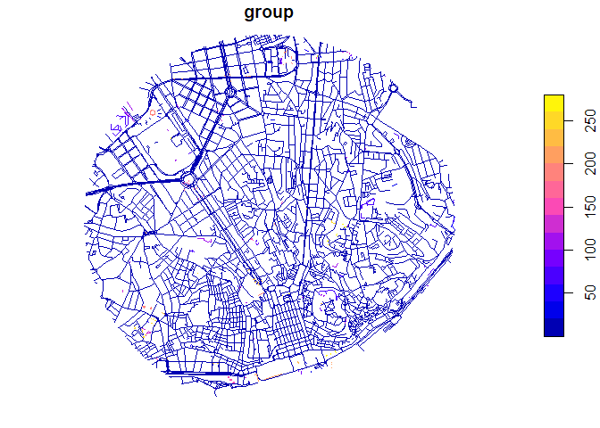
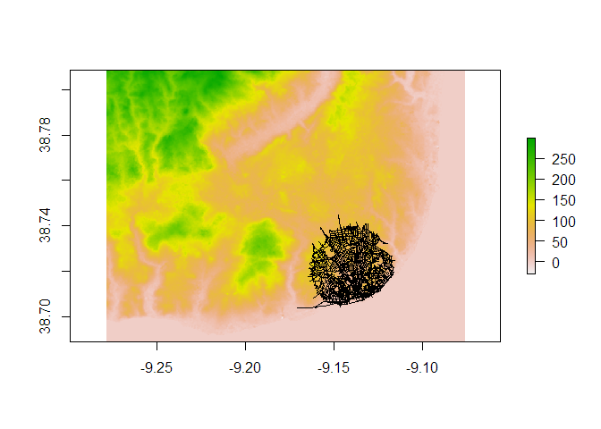
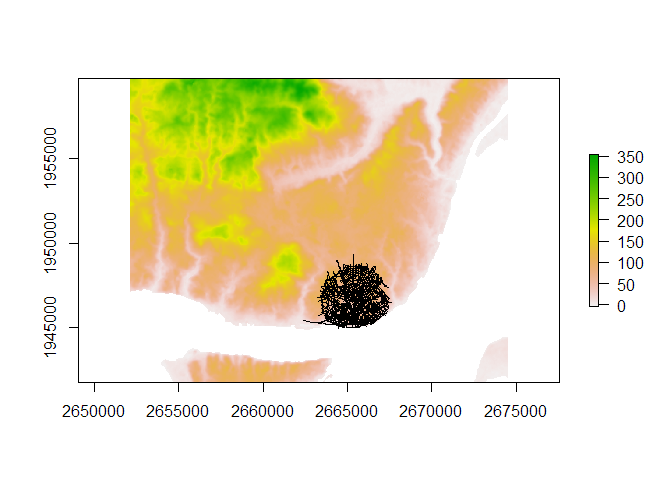
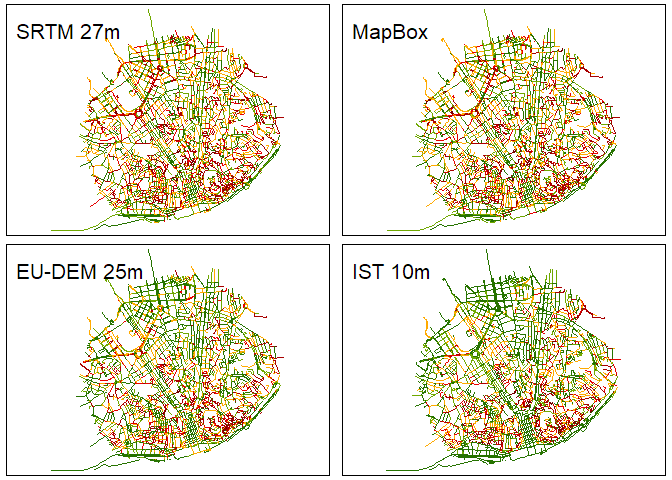

Benchmark Elevation Sources to assess gradient for active transportation
================

## Introduction

Different elevation sources may bring better or worse results, when
computing slopes for a road network.  
In many cases, the resolution of raster digital elevation models (DEM)
does not matter much, when we assume that they will be small enough for
large segments - for instance, if we need to know the gradient of a 2km
length highway, planned for motorized vehicles.  
But when physical effort matters, such as for active travel (walking,
cycling), a 50m road with a 2% gradient might be very different that an
8% gradient.  
For smaller road segments, getting an accurate gradient value might be
an issue, in particular when the free and open data sources do not
provide a good resolution.  
In this example, we will see and compare the results of [slopes R
package](https://github.com/ITSLeeds/slopes) for the same road network
sample (in Lisbon, Portugal), using **four** different elevation data
sources, with different resolution.

## Literature

Google Maps Terrain is improving every year ([Harris
2014](#ref-Harris2014); [El-Ashmawy 2016](#ref-Egypt2016); [Wang
2017](#ref-Wang2017)). It started by using SRTM data, but now at some
places, it recurs to LIDAR technology ([Scott 2010](#ref-Scott2010)),
although not available yet for all places (see:
<https://en.wikipedia.org/wiki/National_lidar_dataset>). It requires an
API key for [elevation
access](https://developers.google.com/maps/documentation/elevation/overview).

[OpenTopoData](https://www.opentopodata.org/#public-api) provides a nice
comparison of the available topographic data, regarding its resolution
and coverage. Unfortunately, the open ones, with a good resolution, only
cover USA and New Zeland.

## Materials - Data sources

Open data sources.

### For Elevation Models

For this example, we will use and compare four elevation sources:

-   NASA Digital Elevation Model, with 27m cell resolution
-   MapBox-Terrain tiles, with 0.1 meter height increments (ref)
-   Copernicus European DEM, with 25m cell resolution
-   Instituto Superior Técnico Digital Elevation Model, with 10m cell
    resolution

##### NASA DEM

The SRTM NASA’s mission Os dados do SRTM ([Shuttle Radar Topography
Mission](https://www.usgs.gov/centers/eros/science/usgs-eros-archive-digital-elevation-shuttle-radar-topography-mission-srtm-1-arc)),
uma missão da NASA, estão disponíveis gratuitamente, mas para uma
resolução de \~30m, com erro da altimetria vertical de 16m. Para fazer
donwload do tile correcto, pode-se também recorrer a um outro plugin do
QGIS, o SRTM-Donwloader, e pedir para guardar o raster que cobre a
shapefile da rede viária - é uma opção no QGIS, e é necessário[registar
uma conta](https://ers.cr.usgs.gov/login).

This extracted with QGIS SRTM Downloader plugin and clipped)

##### MapBox tiles

Package ceramic <https://github.com/hypertidy/ceramic>

<https://docs.mapbox.com/help/troubleshooting/access-elevation-data/>
Requires an API key The slopes\_3d() function from slopes packages
retrieves the z-values information for each vertice, storing an xy
linestring as a xyz linestring.

##### Copernicus DEM

The European Land Monitoring Service ([“EU-DEM V1.1”
2019](#ref-copernicus_2019))  
25m resolution and vertical accuracy of +/- 7m RMSE ([“Copernicus Land
Monitoring Service - Reference Data: EU-DEM (tech.)”
2017](#ref-copernicus_2017)), for all Europe.

##### IST DEM

This DEM was acquired by Instituto Superior Técnico (University of
Lisbon) by 2012, covers all the Northern Metropolitan Area of Lisbon,
and has a 10m cell resolution, when projected at the official Portuguese
EPSG: 3763 - TM06/ETRS89. No more is known about this raster, and it has
been used in several projects at CERIS Research Center.

### For the road network

A sample of Lisbon’s Road Network, available on OpenStreetMap.  
After retrieving the data from “portugal” - the only dataset available
at the moment for the case study -, we will make a buffer of 2000m
around “Campo Martires Patria,” right in the center of Lisbon, and
collect a sample that contains variability regarding:

-   types of highways, from large avenues to small stairs
-   orthogonal and organic highways or streets
-   flat and hilly highways
-   flat and hilly areas
-   long and short highways

## Methods

### To prerare the road netwotk

``` r
#load packages
library(dplyr)
library(sf)
library(osmextract)
library(stplanr)
library(slopes)
library(raster)
library(geodist)
library(tmap)
```

1.  Retrieve the OSM road network and filter by highway classes,
    removing pathways

``` r
portugal_osm = oe_get("Portugal", provider = "geofabrik", stringsAsFactors = FALSE, quiet = FALSE, force_download = TRUE, force_vectortranslate = TRUE) #218 MB!
```

``` r
portugal_osm_filtered = portugal_osm %>%
  dplyr::filter(
    highway %in% c(
      'primary',"primary_link",'secondary',"secondary_link",
      'tertiary',"tertiary_link","trunk","trunk_link",
      "motorway","motorway_link","service","track",
      "residential","cycleway","living_street","pedestrian",
      "steps", "unclassified"
    )
  )
```

1.  Create a buffer area with 2km around a point in the center of
    Lisbon, and clip the road network with it

``` r
#buffer area
lisbon_sf = tmaptools::geocode_OSM("campo mártires da pátria", as.sf = TRUE)
lisbon_buffer = stplanr::geo_buffer(shp = lisbon_sf, dist = 2000)
#clip
osm_lines_lisbon = st_crop(portugal_osm_filtered, lisbon_buffer) %>%  #clip by bounding box
                    st_intersection(lisbon_buffer)
```

1.  Clean the road netwok, by removing unconnected segments

``` r
osm_lines_lisbon$group = stplanr::rnet_group(osm_lines_lisbon)
plot(osm_lines_lisbon["group"])
```

<!-- -->

``` r
osm_lines_lisbon_clean = osm_lines_lisbon %>% filter(group == 1) #keep only the main network cluster

# st_geometry(osm_lines_lisbon_clean) #geometry type:  GEOMETRY || it is required to be LINESTRING
```

1.  Filter from the OSM original network, the segments in the clean one

``` r
RoadNetwork = portugal_osm_filtered %>% filter(osm_id %in% osm_lines_lisbon_clean$osm_id) #ficar apenas os segmentos da rede limpa
```

1.  Breaking up the road segments at their internal vertices, but
    leaving *brunels* intact

``` r
RoadNetwork = stplanr::rnet_breakup_vertices(RoadNetwork)
nrow(RoadNetwork)
```

    ## [1] 6260

### To estimate the slope of road network segments

##### With NASA DEM

-   Import the DEM and make sure the road network dataset has the same
    projection

``` r
demNASA = raster::raster("raster/LisboaNASA_clip.tif")
summary(values(demNASA))
```

    ##    Min. 1st Qu.  Median    Mean 3rd Qu.    Max. 
    ##  -29.00   17.00   82.00   82.63  121.00  299.00

<!-- -->

-   Estimate the gradient

``` r
RoadNetworkNASA = RoadNetwork
RoadNetworkNASA$slope = slope_raster(RoadNetworkNASA, e = demNASA)
RoadNetworkNASA$slope_pct = RoadNetworkNASA$slope*100 #percentage
```

##### With Map Box

-   Estimate the gradient, directly with `slopes`

``` r
RoadNetworkMBox = slope_3d(r= RoadNetwork)
```

    ## Loading required namespace: ceramic

    ## Preparing to download: 9 tiles at zoom = 13 from 
    ## https://api.mapbox.com/v4/mapbox.terrain-rgb/

``` r
RoadNetworkMBox$slope = slope_xyz(RoadNetworkMBox)
RoadNetworkMBox$slope_pct = RoadNetworkMBox$slope*100 #percentage
```

##### With EU-DEM

-   Import the DEM and make sure the road network dataset has the same
    projection

``` r
demEU = raster::raster("raster/LisboaCOPERNICUS_clip.tif")
crs(demEU) = CRS('+init=EPSG:3035') #assign official projection (ETRS89-LAEA)
```

<!-- -->

-   Estimate the gradient

``` r
RoadNetworkEU$slope = slope_raster(RoadNetworkEU, e = demEU)
RoadNetworkEU$slope_pct = RoadNetworkEU$slope*100 #percentage
```

##### With IST DEM

-   Import the DEM and make sure the road network dataset has the same
    projection

``` r
demIST = raster::raster("raster/LisboaIST_clip_r1.tif")
crs(demIST) = CRS('+init=EPSG:3763') #assign official projection (Portugal TM06/ETRS89)
```

<!-- -->

-   Estimate the gradient

``` r
RoadNetworkIST$slope = slope_raster(RoadNetworkIST, e = demIST)
RoadNetworkIST$slope_pct = RoadNetworkIST$slope*100 #percentage
```

## Results

#### Compare the used DEM values

|                   | resolution |   Min. | 1st Qu. | Median |   Mean | 3rd Qu. |   Max. |   NA’s |
|:------------------|-----------:|-------:|--------:|-------:|-------:|--------:|-------:|-------:|
| STRM NASA         |      27.78 | -29.00 |   17.00 |  82.00 |  82.63 |  121.00 | 299.00 |    -29 |
| EU-DEM Copernicus |      25.00 |  -3.18 |   53.30 |  95.40 | 105.83 |  147.95 | 353.67 | 181269 |
| IST DEM           |      10.00 |  -0.22 |   54.96 |  87.48 |  93.85 |  122.62 | 293.51 | 695616 |

DEM information for the area

#### Compare the estimated gradient values for each method

|                   |  Min. | 1st Qu. | Median |  Mean | 3rd Qu. |   Max. |
|:------------------|------:|--------:|-------:|------:|--------:|-------:|
| STRM NASA         | 0.000 |   3.172 |  6.204 | 7.763 |  10.580 | 51.354 |
| Ceramic MapBox    | 0.003 |   2.916 |  5.692 | 7.232 |   9.964 | 43.584 |
| EU-DEM Copernicus | 0.000 |   2.014 |  4.249 | 5.680 |   7.902 | 33.542 |
| IST DEM           | 0.000 |   1.518 |  3.711 | 5.672 |   7.523 | 77.639 |

Result summaries

-   Adopt a simplistic qualitative classification for cycling effort
    uphill, and compare the number of segments in each class

|                   | 0-3: flat | 3-5: mild | 5-8: medium | 8-10: hard | 10-20: extreme | &gt;20: impossible |
|:------------------|----------:|----------:|------------:|-----------:|---------------:|-------------------:|
| STRM NASA         |      23.2 |      17.4 |        22.3 |        9.6 |           22.5 |                5.1 |
| Ceramic MapBox    |      25.9 |      18.1 |        22.1 |        9.1 |           20.7 |                4.2 |
| EU-DEM Copernicus |      37.1 |      19.6 |        18.9 |        7.6 |           14.8 |                2.0 |
| IST DEM           |      42.2 |      18.8 |        16.3 |        6.9 |           12.1 |                3.8 |

Percentage of road segments in each gradient interval and qualitative
class

-   View maps side by side

<!-- --><!-- -->

## Discussion

*Google Elevation data will also be compared.*

## References

<div id="refs" class="references csl-bib-body hanging-indent">

<div id="ref-copernicus_2017" class="csl-entry">

“Copernicus Land Monitoring Service - Reference Data: EU-DEM (tech.).”
2017. *Copernicus*. European Environment Agency.
<https://land.copernicus.eu/user-corner/publications/eu-dem-flyer/at_download/file>.

</div>

<div id="ref-Egypt2016" class="csl-entry">

El-Ashmawy, Khalid L. A. 2016. “Investigation of the Accuracy of Google
Earth Elevation Data.” *Artificial Satellites* 51 (3): 89–97.
https://doi.org/<https://doi.org/10.1515/arsa-2016-0008>.

</div>

<div id="ref-copernicus_2019" class="csl-entry">

“EU-DEM V1.1.” 2019. *Copernicus*.
<https://land.copernicus.eu/imagery-in-situ/eu-dem/eu-dem-v1.1>.

</div>

<div id="ref-Harris2014" class="csl-entry">

Harris, Matt. 2014. “Compare Google API Elevation to Known Resolution
Digital Elevation Models (DEM).” *RPubs*. RStudio.
<https://rpubs.com/mharris/GoogleAPI>.

</div>

<div id="ref-Scott2010" class="csl-entry">

Scott, Chelsea. 2010. “LiDAR Beginning to Appear in Google Maps Terrain
Layer.” *OpenTopography*. National Science Foundation.
<https://www.opentopography.org/blog/lidar-beginning-appear-google-maps-terrain-layer>.

</div>

<div id="ref-Wang2017" class="csl-entry">

Wang, Yajie AND Henrickson, Yinsong AND Zou. 2017. “Google Earth
Elevation Data Extraction and Accuracy Assessment for Transportation
Applications.” *PLOS ONE* 12 (4): 1–17.
<https://doi.org/10.1371/journal.pone.0175756>.

</div>

</div>
