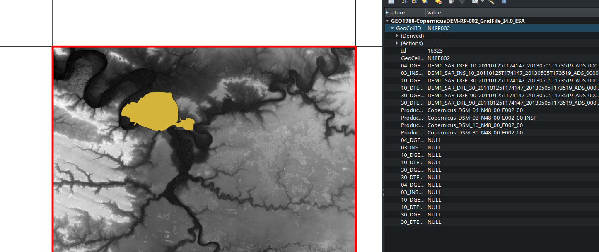

```{r setup, include=FALSE}
knitr::opts_chunk$set(echo = TRUE, warning = FALSE)
```

Mapas com os declives de uma rede viária

Este repositório explica como produzir um mapa de declives de uma rede viária em *open source software*, usando como exemplo o caso da cidade do Porto.\
Para criar o mapa de declives, são necessários dois ficheiros:

-   Rede viária, em shapefile ou outro formato vectorial
-   Modelo Digital do Terreno ou de Elevação (MDT, DEM), em raster (tif ou outro)

Recomenda-se estes dois softwares:

-   [R project](https://www.r-project.org/)
-   [QGIS](https://qgis.org/en/site/)

*For an english version, check this [quick script](https://github.com/U-Shift/Declives-RedeViaria/blob/main/code/slopes_iow.R).*

## Perparação dos ficheiros

### Rede Viária

A rede viária pode ser obtida de várias formas. Em primeiro lugar, experimentar procurar nos "dados abertos" da câmara municipal em questão. Esses dados estão normalmente *limpos* e actualizados.

Caso não estejam disponíveis, pode-se usar os dados abertos do [**Open Steet Map**](https://www.openstreetmap.org/) (OSM).\
O problema é que a rede viária normalmente tem de ser *limpa*. Por exemplo, faz sentido manter as escadas, os túneis e auto-estradas para caminhos em bicicleta?\
**Ver o tutorial de como extrair e limpar uma rede viária do OSM, usando apenas o *R***: [tutorials/OSMextract_prepare.md](https://github.com/U-Shift/Declives-RedeViaria/blob/main/tutorials/OSMextract_prepare.md).

Ou então, pode-se recorrer ao **QGIS** (outro software livre de Sistemas de Informação Geográfica), e instalar um plugin [**OSM donwloader**](https://plugins.qgis.org/plugins/OSMDownloader/). Instalar um plugin no QGIS [é simples](https://docs.qgis.org/3.10/en/docs/training_manual/qgis_plugins/fetching_plugins.html).

Para o Porto, o ficheiro `RedeViariaPorto_osm.shp` já foi limpo segundo o [tutorial](https://github.com/U-Shift/Declives-RedeViaria/blob/main/tutorials/OSMextract_prepare.md), e está disponibilizado na pasta `shapefiles`.

### Modelo Digital do Terreno

Estes raster são difíceis de obter gratuitamente para resoluções melhores. Para o caso de uma Rede Viária, seria bom ter um raster com células de 10metros ou menos.

Os dados do **SRTM** (*Shuttle Radar Topography Mission*), uma missão da NASA, estão [disponíveis gratuitamente](https://gisgeography.com/srtm-shuttle-radar-topography-mission/), mas para uma resolução de 25 a 30m, com erro da altimetria vertical de 16m - [saber mais](https://www2.jpl.nasa.gov/srtm/). Para fazer donwload do *tile* correcto, pode-se também recorrer a um outro plugin do QGIS, o [SRTM-Donwloader](https://plugins.qgis.org/plugins/SRTM-Downloader/), e pedir para guardar o raster que cobre a shapefile da rede viária - é uma opção no QGIS.

Em alternativa, a **COPERNICUS**, uma missão da ESA, também [disponibiliza gratuitamente](https://land.copernicus.eu/imagery-in-situ/eu-dem) os DEM para toda a Europa, e com uma resolução de 25, com erro da altimetria vertical de 7m - [saber mais](https://land.copernicus.eu/user-corner/publications/eu-dem-flyer/view). Trata-se de um produto que é baseado no SRTM e no ASTER GDEM, com uma abordagem de ponderação de pesos. A sua versão anterior (1.0) apresentava uma precisão média de 2.9m verticais, quando foi validada.\
Para escolher o *tile* correcto, pode-se [navegar no mapa](https://land.copernicus.eu/imagery-in-situ/eu-dem/eu-dem-v1.1), e seleccionar os ficheiros. Para fazer download é necessário fazer login ([registo gratuito](https://land.copernicus.eu/@@register)).\
**Entretanto ficou descontinuado.**

O novo método passa por escolher o tile a partir da grid, identificar as coordenadas, e alterar o seguinte link:

> Example of direct query for a 30m DEM tile (North 29°- East 14°): <https://prism-dem-open.copernicus.eu/pd-desk-open-access/prismDownload/COP-DEM_GLO-30-DGED__2022_1/Copernicus_DSM_10_N29_00_E014_00.tar> [source](https://sentinels.copernicus.eu/web/sentinel/-/copernicus-dem-new-direct-data-download-access)

{width="800"}

Como o raster cobre uma área bem maior do que necessitamos (ver ficheiro `N41W009.hgt`), podemos sempre fazer um *clip* para ficar com dimensões mais adequadas à nossa análise: `Raster > Extraction > Clip Raster by Extent`.\
O ficheiro `PortoNASA_clip.tif` ou `PortoCOPERNICUS_clip.tif` na pasta `raster` já foi cortado para uma área mais adequada à cidade do Porto.

> Neste caso, é necessário re-projectar a rede viária no sistema de coordenadas do DEM: `EPGS-3035` para ETRS89-LAEA. (*já não se aplica!*)

## Cálculo dos Declives

O ficheiro `slopes.R` na pasta `code` pode ser corrido em R. Antenção para mudar os "caminhos" onde estão os ficheiros raster e shapefile.

São necessários os seguintes packages:

```{r libraries, message=FALSE, warning=FALSE}
library(sf)
library(raster)
library(geodist)
library(slopes)
library(tmap)
```

### importar ficheiros

#### shapefile

```{r}
RedeViaria = st_read("shapefiles/RedeViariaPorto_osm.shp")
# RedeViaria = st_transform(RedeViaria, 4326) #projectar em WGS84
# RedeViaria = st_cast(RedeViaria, "LINESTRING", do_split=F) #o slopes só permite linestrings, mas não deixarque parta as linhas
class(RedeViaria)
```

Esta rede tem quase 14mil segmentos.

#### raster com altimetria

```{r}
DEM = raster("raster/PortoNASA_clip.tif")
class(DEM)
summary(values(DEM))
res(DEM)
```

Este raster tem valores de altimetria entre -10 e 178m. As células são de 27.7m

#### visualizar

O DEM e a Rede Vuária têm de estar no mesmo sistema de coordenadas.

```{r}
raster::plot(DEM)
plot(sf::st_geometry(RedeViaria), add = TRUE)
```

### Declives

Através do package [**slopes**](https://github.com/ropensci/slopes), vai-se calcular os declives de cada segmento da rede, em modo absoluto. Ler mais na página do package sobre como são calculados.

```{r message=FALSE, warning=FALSE}
RedeViaria$slope = slope_raster(RedeViaria, dem = DEM) #28 segundos
```

Declives em percentagem: *mínimo, P25, mediana, média, P75, max*.

```{r}
RedeViaria$declive = RedeViaria$slope*100
summary(RedeViaria$declive)
```

Isto significa que metade das vias tem mais de 4% de inclinação, o que é bastante.

Criar classes de declives, com labels perceptíveis

```{r}
RedeViaria$declive_class =  RedeViaria$declive %>%
  cut(
    breaks = c(0, 3, 5, 8, 10, 20, Inf),
    labels = c("0-3: plano", "3-5: leve","5-8: médio", "8-10: exigente", "10-20: terrível", ">20: impossível"),
    right = F
  )
```

Ver a percentagem de cada classe para toda a rede

```{r}
round(prop.table(table(RedeViaria$declive_class))*100,1)
```

... o que quer dizer que 34.3% das ruas são planas ou quase planas, e cerca de 58% são perfeitamente cicláveis.

> Ao usarmos o DEM europeu ([Copernicus](raster/PortoCOPERNICUS_clip.tif)) os resultados são diferentes: 50.9% das vias são planas ou quase planas (0-3%) e cerca de 72% das vias são perfeitamente cicláveis (0-5%). Experimenta!

Pode-se agora calcular a extensão das ruas

```{r}
RedeViaria$length = st_length(RedeViaria)
```

e exportar novamente o shapefile

```{r eval=FALSE}
#exportar shapefile com os declives, em formato GeoPackage (QGIS)
st_write(RedeViaria, "shapefiles/RedeViariaPorto_declives.gpkg", append=F)
#exportar em formato kml (GoogleMaps)
st_write(RedeViaria, "shapefiles/RedeViariaPorto_declives.kml", append=F)
```

## Exportar para html

### Preparar dados para visualização

Criar uma palete de cores, entre o verde escuro e o vermelho escuro

```{r}
palredgreen = c("#267300", "#70A800", "#FFAA00", "#E60000", "#A80000", "#730000")
```

### Criar o mapa em html

usando o [**tmap**](https://github.com/mtennekes/tmap/)

```{r eval=FALSE, message=FALSE, warning=FALSE, echo=TRUE}
tmap_mode("view")
tmap_options(basemaps = leaflet::providers$CartoDB.Positron) #mapa base
mapadeclives =
tm_shape(RedeViaria) +
  tm_lines(
    col = "declive_class",
    palette = palredgreen, #palete de cores
    lwd = 2, #espessura das linhas
    title.col = "Declive [%]",
    popup.vars = c("Tipo: " = "highway",
                   "Comprimento" = "length",
                   "Declive: " = "declive",
                   "Classe: " = "declive_class"),
    popup.format = list(digits = 1),
    # id = "declive"
    id = "name" #se o computaor não conseguir exportar por falta de memória, apagar esta linha.
  )
mapadeclives
```

#### Gravar em html

```{r eval=FALSE}
tmap_save(mapadeclives, "DeclivesPorto_SRTM.html")
```

*Dependendo do tamanho da rede, pode ser exigente para a RAM. Esta tinha cerca de 14mil arcos, e só consegui exportar num pc com 16GB de RAM*

O mapa final pode ser visto online aqui: <http://web.tecnico.ulisboa.pt/~rosamfelix/gis/declives/DeclivesPorto.html>

## Para Lisboa

O portal de [dados abertos da CML](http://lisboaaberta.cm-lisboa.pt/index.php/pt/) disponibiliza uma rede viária, embora só para [vias de heirarquia superior](http://dados.cm-lisboa.pt/dataset/rede-viaria-escala-1-20000), e um [Modelo Digital do Terreno](http://dados.cm-lisboa.pt/dataset/modelo-digital-de-terreno), embora com uma resolução de 48m.

Por outro lado, disponibiliza dados sobre o [declive longitudinal das vias](http://dados.cm-lisboa.pt/dataset/declive-longitudinal-da-rede-viaria), com uma rede detalhada, e já com o valor de declive (`slope`), embora não forneça informação sobre que tipo de raster foi utilizado para o seu cálculo.

### Exercício

1.  Experimenta fazer o mesmo exercício, gravando o output do `slope_raster` na variável `slopeNASA` (para não fazer overwrite do `slope`), e **compara os resultados**. Podes usar o `raster/LisboaNASA_clip.tif`
2.  Compara os resultados com os declives calculados com um raster de 10m, do IST. Shapefile disponível em `shapefiles/RedeViariaLisboa2012_declives_etrs89.gpkg`. Que diferenças?

Declives da rede viária de Lisboa (10m): <http://web.tecnico.ulisboa.pt/~rosamfelix/gis/declives/DeclivesLisboa.html>


> A mediana do declive das ruas de Lisboa é de 2.6%. 49% das vias são planas ou quase planas (0-3%) e cerca de 72% das vias são perfeitamente cicláveis (0-5%).

## Mapas de declives, criados a partir deste script

-   [Almada (NASA)](https://web.tecnico.ulisboa.pt/~rosamfelix/gis/declives/DeclivesAlmada_SRTM.html) \| [Almada (ESA)](https://web.tecnico.ulisboa.pt/~rosamfelix/gis/declives/DeclivesAlmada_EU.html)
-   [Amadora](https://web.tecnico.ulisboa.pt/~rosamfelix/gis/declives/DeclivesAmadora_EU.html)
-   [Aveiro](https://web.tecnico.ulisboa.pt/~rosamfelix/gis/declives/DeclivesAveiro_EU.html)
-   [Braga (NASA)](https://web.tecnico.ulisboa.pt/~rosamfelix/gis/declives/DeclivesBraga.html) \| [Braga (ESA)](https://web.tecnico.ulisboa.pt/~rosamfelix/gis/declives/DeclivesBraga_EU.html)
-   [Cascais](https://web.tecnico.ulisboa.pt/~rosamfelix/gis/declives/DeclivesCascais_EU.html)
-   [Coimbra](https://web.tecnico.ulisboa.pt/~rosamfelix/gis/declives/DeclivesCoimbra_EU.html)
-   [Guarda](https://web.tecnico.ulisboa.pt/~rosamfelix/gis/declives/DeclivesGuarda.html)
-   [Lisboa](https://web.tecnico.ulisboa.pt/~rosamfelix/gis/declives/DeclivesLisboa.html)
-   [Loures](https://web.tecnico.ulisboa.pt/~rosamfelix/gis/declives/DeclivesLoures.html)
-   [Oeiras](https://web.tecnico.ulisboa.pt/~rosamfelix/gis/declives/DeclivesOeiras_EU.html)
-   [Porto (NASA)](https://web.tecnico.ulisboa.pt/~rosamfelix/gis/declives/DeclivesPorto_SRTM.html) \| [Porto (ESA)](https://web.tecnico.ulisboa.pt/~rosamfelix/gis/declives/DeclivesPorto_EU.html)
-   [Vila Nova de Gaia](https://web.tecnico.ulisboa.pt/~rosamfelix/gis/declives/DeclivesGaia_EU.html)
-   [Isle of Wight (UK)](https://web.tecnico.ulisboa.pt/~rosamfelix/gis/declives/SlopesIoW.html)
-   [Leeds (UK)](https://web.tecnico.ulisboa.pt/~rosamfelix/gis/declives/SlopesLeeds.html)
-   [São Paulo (BR)](https://web.tecnico.ulisboa.pt/~rosamfelix/gis/declives/DeclivesSaoPaulo.html)
-   [Medellín (CO)](https://web.tecnico.ulisboa.pt/~rosamfelix/gis/declives/SlopesMedellin.html)
-   [Zurich (CH)](https://web.tecnico.ulisboa.pt/~rosamfelix/gis/declives/SlopesZurich.html)
-   [Amsterdam (NL)](https://web.tecnico.ulisboa.pt/~rosamfelix/gis/declives/SlopesAmsterdam.html)
-   [Paris (NASA)](http://rosafelix.bike/gis/declives/SlopesParis_NASA.html) \| [Paris (ESA)](http://rosafelix.bike/gis/declives/SlopesParis_ESA.html)
