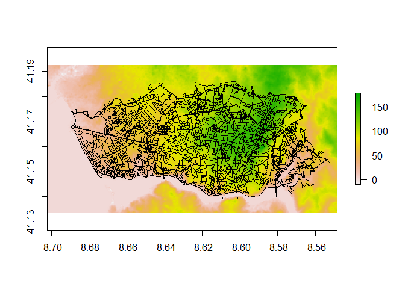
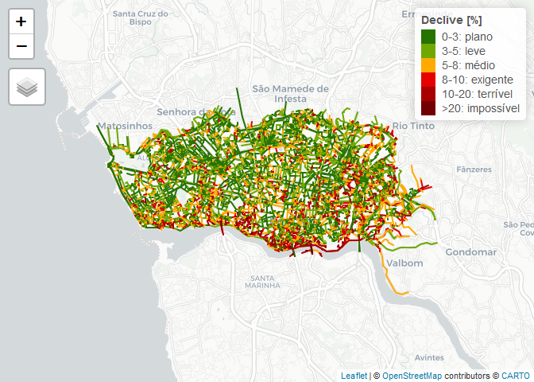

Declives RedeViaria
================

Mapas com os declives de uma rede viária

Este repositório explica como produzir um mapa de declives de uma rede viária em *open source software*, usando como exemplo o caso da cidade do Porto.
Para criar o mapa de declives, são necessários dois ficheiros:

-   Rede viária, em shapefile ou outro formato vectorial
-   Modelo Digital do Terreno ou de Elevação (MDT, DEM), em raster (tif ou outro)

Recomenda-se estes dois softwares:

-   [R project](https://www.r-project.org/)
-   [QGIS](https://qgis.org/en/site/)

Perparação dos ficheiros
------------------------

### Rede Viária

A rede viária pode ser obtida de várias formas. Em primeiro lugar, experimentar procurar nos "dados abertos" da câmara municipal em questão. Esses dados estão normalmente *limpos* e actualizados.

Caso não estejam disponíveis, pode-se usar os dados abertos do [**Open Steet Map**](https://www.openstreetmap.org/) (OSM).
Para tal, pode-se recorrer ao **QGIS** (outro software livre de Sistemas de Informação Geográfica), e instalar um plugin [**OSM donwloader**](https://plugins.qgis.org/plugins/OSMDownloader/). Instalar um plugin no QGIS [é simples](https://docs.qgis.org/3.10/en/docs/training_manual/qgis_plugins/fetching_plugins.html).

O problema é que a rede viária normalmente tem de ser *limpa*. Por exemplo, faz sentido manter as escadas, os túneis e auto-estradas para caminhos em bicicleta?

Para o Porto, o ficheiro `sentidos-link.shp` já foi limpo pelo [mpschlickmann](https://github.com/mpschlickmann), e está disponibilizado na pasta `shapefiles`.

### Modelo Digital do Terreno

Estes raster são difíceis de obter gratuitamente para resoluções melhores. Para o caso de uma Rede Viária, seria bom ter um raster com células de 10metros ou menos.

Os dados do SRTM (*Shuttle Radar Topography Mission*), uma missão da NASA, estão [disponíveis gratuitamente](https://gisgeography.com/srtm-shuttle-radar-topography-mission/), mas para uma resolução de 25 a 30m, com erro da altimetria vertical de 16m. Para fazer donwload do *tile* correcto, pode-se também recorrer a um outro plugin do QGIS, o [SRTM-Donwloader](https://plugins.qgis.org/plugins/SRTM-Downloader/), e pedir para guardar o raster que cobre a shapefile da rede viária - é uma opção no QGIS.

Como o raster cobre uma área bem maior do que necessitamos (ver ficheiro `N41W009.hgt`), podemos sempre fazer um *clip* para ficar com dimensões mais adequadas à nossa análise: `Raster > Extraction > Clip Raster by Extent` O ficheiro `PortoNASA_clip.tif` na pasta `raster` já foi cortado para uma área mais adequada à cidade do Porto.

Cálculo dos Declives
--------------------

O ficheiro `slopes.R` na pasta `code` pode ser corrido em R. Antenção para mudar os "caminhos" onde estão os ficheiros raster e shapefile.

São necessários os seguintes packages:

``` r
library(sf)
library(raster)
library(geodist)
library(slopes)
library(tmap)
```

### importar ficheiros

#### shapefile

``` r
RedeViaria = st_read("shapefiles/sentidos_link.shp")
```

    ## Reading layer `sentidos_link' from data source `D:\GIS\Porto\Declives-RedeViaria\shapefiles\sentidos_link.shp' using driver `ESRI Shapefile'
    ## Simple feature collection with 19854 features and 6 fields
    ## geometry type:  LINESTRING
    ## dimension:      XY
    ## bbox:           xmin: -966257.6 ymin: 5027255 xmax: -950956 ymax: 5034212
    ## projected CRS:  Sphere_Mercator

``` r
#está em coodenadas esféricas, projectar em WGS84
RedeViaria = st_transform(RedeViaria, 4326) 
class(RedeViaria)
```

    ## [1] "sf"         "data.frame"

Esta rede tem quase 20mil segmentos.

#### raster com altimetria

``` r
DEM = raster("raster/PortoNASA_clip.tif")
class(DEM)
```

    ## [1] "RasterLayer"
    ## attr(,"package")
    ## [1] "raster"

``` r
summary(values(DEM))
```

    ##    Min. 1st Qu.  Median    Mean 3rd Qu.    Max. 
    ##  -10.00   24.00   72.00   65.87   97.00  178.00

Este raster tem valores de altimetria entre -10 e 178m. As células são de 27.7m

#### visualizar

``` r
raster::plot(DEM)
plot(sf::st_geometry(RedeViaria), add = TRUE)
```



### Declives

Através do package [**slopes**](https://github.com/itsleeds/slopes), vai-se calcular os declives de cada segmento da rede, em modo absoluto. Ler mais na página do package sobre como são calculados.

``` r
RedeViaria$slope = slope_raster(RedeViaria, e = DEM) #62 segundos
```

    ## [1] FALSE

Declives em percentagem: *mínimo, P25, mediana, média, P75, max*.

``` r
RedeViaria$declive = RedeViaria$slope*100
summary(RedeViaria$declive)
```

    ##    Min. 1st Qu.  Median    Mean 3rd Qu.    Max. 
    ##   0.000   2.176   4.007   5.099   6.795  54.882

Isto significa que metade das vias tem mais de 4% de inclinação, o que é bastante. Para Lisboa, esse valor é de 2.6%.

Pode-se agora exportar novamente o shapefile

``` r
#exportar shapefile com os declives, em formato GeoPackage (QGIS)
st_write(RedeViaria, "shapefiles/RedeViariaPorto_declives.gpkg", append=T)
```

Exportar para html
------------------

### Preparar dados para visualização

Criar classes de declives, com labels perceptíveis

``` r
RedeViaria$declive_class =  RedeViaria$declive %>%
  cut(
    breaks = c(0, 3, 5, 8, 10, 20, Inf),
    labels = c("0-3: plano", "3-5: leve","5-8: médio", "8-10: exigente", "10-20: terrível", ">20: impossível"),
    right = F
  )
```

Ver a percentagem de cada classe para toda a rede

``` r
round(prop.table(table(RedeViaria$declive_class))*100,1)
```

    ## 
    ##      0-3: plano       3-5: leve      5-8: médio  8-10: exigente 10-20: terrível 
    ##            36.6            24.0            21.0             7.2            10.1 
    ## >20: impossível 
    ##             1.1

... o que quer dizer que 36.6% das ruas são planas ou quase planas, e cerca de 60% são perfeitamente cicláveis.
(No caso de Lisboa, cerca de 73% das vias são perfeitamente cicláveis).

Criar uma palete de cores, entre o verde escuro e o vermelho escuro

``` r
palredgreen = c("#267300", "#70A800", "#FFAA00", "#E60000", "#A80000", "#730000")
```

### Criar o mapa em html

usando o [**tmap**](https://github.com/mtennekes/tmap/)

``` r
tmap_mode("view")
tmap_options(basemaps = leaflet::providers$CartoDB.Positron) #mapa base
mapadeclives =
tm_shape(RedeViaria) +
  tm_lines(
    col = "declive_class",
    palette = palredgreen, #palete de cores
    lwd = 2, #espessura das linhas
    title.col = "Declive [%]",
    popup.vars = c("Declive: " = "declive",
                   "Classe: " = "declive_class"),
    popup.format = list(digits = 1),
    id = "NAME"
  )
mapadeclives
```



#### Gravar em html

``` r
tmap_save(mapadeclives, "DeclivesPorto.html")
```

*Dependendo do tamanho da rede, pode ser exigente para a RAM. Esta tinha cerca de 20mil arcos, e só consegui exportar num pc com 16GB*

O mapa final pode ser visto online aqui: <http://web.tecnico.ulisboa.pt/~rosamfelix/gis/declives/DeclivesPorto.html>

(Lisboa - <http://web.tecnico.ulisboa.pt/~rosamfelix/gis/declives/DeclivesLisboa.html> )
