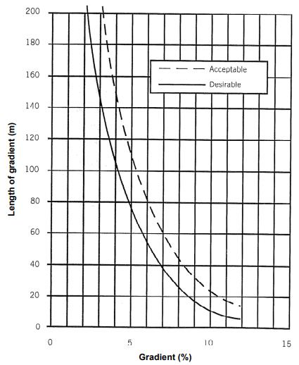

```{r setup, include=FALSE}
knitr::opts_chunk$set(echo = TRUE)
```

```{r include=FALSE}
#import libraries
library(tidyverse)
library(sf)
library(slopes)
library(tmap)
library(mapview)
```

# Cost for bicycle routing models

Bicycle routing models add to car routing modeling a greater complexity that results essentially from the greater number of degrees of freedom associated with cycling (i.e., a smaller, lighter and more versatile vehicle in terms of maneuvering) and the fact that it is human powered and therefore depending on a limited energy, thus depending on the effort that is transmitted by the cyclist himself. This results in a series of specific peculiarities in its riding, namely: a greater number of variables relevant to the routing cost function, and the existence of more subjective variables.

A complexity involved in modeling route choice for cyclists represents a challenge. Even if we understand which variables are determinant for route choice, models become more accurate if it incorporates the versatility of the bicycle in urban context, and its ability to circulate in non-road spaces.

GIS allows modeling a road network in the form of a topological graph, to which a series of functions and algorithms, including the least cost path [@dijkstra1959]. The application of the least cost path algorithm assumes the existence of a graph formed by a set of set of edges and nodes. The edges can be oriented or not and, to these, a travel cost is associated, with one or more parameters, never less than zero. Associating a travel cost to each arc in the network, the route cost is defined as the sum of the costs of the arcs that compose it.

## Speed

For a **constant** urban cycling speed travel (*factor = 1*), let's say 15 km/h, we assume that the speed is linear to the edge extension, and its cost is its travel time.

$$ c_{speed} = \frac{length_{[m]}}{speed_{[m/s]}} = time_{[s]}\tag{Eq.1}$$

Many factors may be determinant for **cycling speed**, such the surface conditions, traffic, weather, mass, type of bicycle, directness, confidence, etc [@hochmair2007; @Felix2012; @broach2012; @broach2016]. Here we will look only to **speed related with gradient**, from the perspective of a common urban cyclist.

## Slope or gradient

When comes to cycling, the route gradient can be a determinant variable to chose a route instead of an alternative. It is commonly known that cyclists are averse to roads with an ascending gradient, and that cyclists prefer roads with a descending gradient. The **direction** of the gradient is determinant.

It is also known, by the gravity laws, that an object traveling at a constant speed, its speed becomes faster when going down the hill, and slower when going uphill. Buy how does it applies to a human behavior? How does it varies when effort, fear, stamina, and reward plays a role? When does a cyclist use the break levers? When does a cyclist slows her pace?

The slope enters the cost function as a proxy for cyclist effort - the amount of energy a cyclist must expend to travel on a street with a given slope - causing the traversing time to increase for uphill routes. On downhill routes, the effort is reduced and the theoretical speed is increased, reducing their traversing time.

@scott2020 designed an experiment for hiking, and applied a rule saying "*A 10% grade incline cuts your speed in half"**.*** In their results, they suggested an equation to calculate uphill speed (for hiking):

$$
speed = speed_{flat} * e^{(-0.04*slope)}\tag{Eq.2}
$$

Which results that with a grade of 20%, one can walk at a speed of 1.78 km/h it her horizontal speed was 4 km/h. When applying to cycling, for a flat speed of 15km/h, the same incline would be ride at a 6.74 km/h speed, which is not reliable for a standard cyclist.

Also, the extension of the road segment enters in the cost function: for longer segments at a given gradient, the effort of the cyclist is higher than for a shorter segment with the same gradient.

Figure 1 shows the maximum lengths of uphill gradient acceptable to cyclists [@austroads2009]. It considers that over a 3% slope, the length should be taken into account.



Sometimes it is more efficient to travel a longer distance with less steep gradients rather than a shorter distance on a steep gradient. Other times the extra distance to ride to overcome the gradient is not so worthwhile and the cyclist chooses to ride up the steeper gradient by hand. The maximum crossing cost penalty was considered to be 10 times for this situation, i.e. for edges with a gradient greater than 20%.

Very steep roads are a problem not only for uphill riding, but also for downhill riding, because a mechanical failure in the brakes can lead to a dangerous situation for the rider, who also has to expend some effort and skill to keep the bike balanced and control the additional risk.

{width="500" align="\"center"}

Downhill edges mostly result in benefit to the cyclist, increasing its speed. However, this is not linear, decreasing from slope values above 13%, and may even slow down the speed (relative to the average flat speed) it too steep.

# Speed-Slope Factor

After an iterative process, which considered the cyclist effort as a function of slope abacuses suggested by @aashto1999 and @austroads2009 (p. 41), and also a cost formula developed by @price2008, Eq. 3 presets a function that models the slope factor based on the slope [%] and length [m] of each road segment. This function, which is non-symmetric and non-monotonic, reproduces the essential characteristics of the slope/effort relationship.

In addition to this function, a second set of criteria is applied (*g*), which increases the *slope factor* when road segments have a given length [m] and slope [%], with intervals as suggested by @ceap-centrodeestudosdearquitecturapaisagista . Eq. 4 shows that edges with gradient between 0 and 20 in the upward direction are thus penalized by accumulation of effort.

$$slope factor_{(slope,length)} = \begin{cases} 1.5 &\Leftarrow \quad slope <-30 \\
1+ 2\frac{0.7}{13} * slope +\frac{0.7}{13^2}*slope^2 &\Leftarrow -30 \leq slope <0 \\
1+ (\frac{slope}{g_{(slope, length)}})^2 &\Leftarrow 0 \leq slope \leq20 \\
10 &\Leftarrow 20 <slope 
\end{cases}\tag{Eq.3} $$

With,

$$g_{(slope,length)} = \begin{cases} 4 &\Leftarrow 10<slope \leq 13 \quad\wedge\quad  length > 15\\
4.5 &\Leftarrow 8 <slope \leq 10 \quad\wedge\quad  length > 30 \\
5 &\Leftarrow 5 <slope \leq 8 \quad\wedge\quad  length > 60 \\
6 &\Leftarrow 3 <slope \leq 5 \quad\wedge\quad  length > 120 \\
7 &\Leftarrow otherwise 
\end{cases}\tag{Eq.4} $$

As the max penalization going uphill should not be 10 times more than the flat speed, we add another condition to maximize the **slope factor**, as follows:

$$slope factor_{(slope,length)}adjst = \begin{cases} 
10 &\Leftarrow slope >13 \quad\wedge\quad  length >15 \\
10 &\Leftarrow slope >10 \quad\wedge\quad  length >30 \\
10 &\Leftarrow slope >8 \quad\wedge\quad  length >60 \\
10 &\Leftarrow slope >5 \quad\wedge\quad  length >120 \\
\end{cases}\tag{Eq.5} $$

<!-- $$slopefactor_{(slope,length)} > 10 \Rightarrow slope factor_{(slope,length)}adjst = 10 \tag{Eq.4} $$-->

```{r include=FALSE}
#g function
g = function(slope, length){
  ifelse((slope > 3 & slope <= 5 & length > 120), 6, 
    ifelse((slope > 5 & slope <= 8 & length > 60), 5, 
      ifelse((slope > 8 & slope <= 10 & length > 30), 4.5,
        ifelse((slope > 10 & slope <= 13 & length > 15), 4,
               7))))
}
#slope-factor function
speedfactor = function(slope, length, g) {
  ifelse(ifelse((slope < -30),1.5,
        ifelse(slope < 0, 1 + (0.7 / 13) * 2 * slope + 0.7 / (13 ^ 2) * slope ^ 2,
           ifelse((slope > 20), 10,
              ifelse((slope >= 0 & slope <= 20), 1 + (slope / g) ^ 2,
                  NA)))) >10, 10,
      ifelse((slope < -30),1.5,
        ifelse(slope < 0, 1 + (0.7 / 13) * 2 * slope + 0.7 / (13 ^ 2) * slope ^ 2,
           ifelse((slope > 20), 10,
              ifelse((slope >= 0 & slope <= 20), 1 + (slope / g) ^ 2,
                  NA)))))
}
#There is probably a way to write this code cleaner...
```

This functions result in a speed factor (in *log* scale) that varies as this:

```{r echo=FALSE}
curve(
  expr = speedfactor(slope = x, g = 7, length = 120),
  from = -35, to = 25, col = "blue", lwd = 3, log = "y",
  xlab = "slope [%]", ylab = "slope factor")
curve(
  expr = speedfactor(slope = x, g = 4, length = 120),
  from = 10, to = 25, col = "purple", lwd = 2, lty = 5, log = "y", add = T)
curve(
  expr = speedfactor(slope = x, g = 4.5, length = 120),
  from = 8, to = 25, col = "grey", lwd = 2, lty = 4, log = "y", add = T)
curve(
  expr = speedfactor(slope = x, g = 5, length = 120),
  from = 5, to = 25, col = "orange", lwd = 2, lty = 3, log = "y", add = T)
curve(
  expr = speedfactor(slope = x, g = 6, length = 120),
  from = 3, to = 25, col = "red", lwd = 2, lty = 2, log = "y", add = T)
curve(
  expr = speedfactor(slope = x, g = 7, length = 120),
  from = -35, to = 25, col = "blue", lwd = 2, log = "y", add = T)
abline(h = 1, v = 0, lty = 3)
title(main = "Slope-Speed function")
legend(-30, 9,
  legend = c(
    "speed factor (base)",
    "slope >3%, length >120 m",
    "slope >5%, length >60 m",
    "slope >8%, length >30 m",
    "slope >10%, length >15 m"),
  col = c("blue", "red", "orange", "grey", "purple"),
  lty = 1:5, cex = 0.9, lwd = c(3, 2, 2, 2, 2), box.lty = 0)
```

And, finally, we divide the constant flat speed by the *slope factor* as :

$$
speed = \frac{speed_{flat}}{slope factor}\tag{Eq.5}
$$

```{r eval=FALSE, include=FALSE}
speed = speedflat / speedfactor(slope, length, g = g(slope, length))
```

## What does it means uphill?

When going **uphill**, speed will reduce, and longer the road segments, higher the denominator, and slower the cyclist speed.

For instance, if assuming a constant flat speed of 15 km/h and a road with 80 m and 3% uphill, a cyclist will reduce to 12.67 km/h

```{r}
speedflat = 15
slope = 3
length = 50
speedflat / speedfactor(slope, length, g = g(slope, length))
```

If it is slightly **steeper**, with 4% uphill, a cyclist will reduce to 11.31 km/h

```{r}
slope = 4
length = 50
speedflat / speedfactor(slope, length, g = g(slope, length))
```

If that same segment is **longer**, a cyclist will reduce to 10.38 km/h

```{r}
slope = 4
length = 150
speedflat / speedfactor(slope, length, g = g(slope, length))
```

For **higher gradients**, the speed decreases with more sensitivity regarding the **segment length**.

```{r}
slope = 6
length = 60
speedflat / speedfactor(slope, length, g = g(slope, length))
```

```{r}
slope = 6
length = 80
speedflat / speedfactor(slope, length, g = g(slope, length))
```

And for **very steep streets**, cycling speed may reduce to walking speed.

```{r}
slope = 9
length = 40
speedflat / speedfactor(slope, length, g = g(slope, length))
```

## And downhill?

In another hand, when going **downhill**, speeds will increase until it gets 3.33x faster, when the gradient is 13%. For steeper gradients, the cyclist will tend to break, and the speed will be lower.

Until the moment when it gets so scary to ride it (again, for a regular urban cyclist with mild experience), that it will take more time to travel that road than if it was flat.

```{r}
length = 100
slope = -8
speedflat / speedfactor(slope, length, g = g(slope, length))
slope = -13
speedflat / speedfactor(slope, length, g = g(slope, length))
slope = -20
speedflat / speedfactor(slope, length, g = g(slope, length))
slope = -25
speedflat / speedfactor(slope, length, g = g(slope, length))
slope = -30
speedflat / speedfactor(slope, length, g = g(slope, length))
```

# Case Study

Here we will use a small road network from downtown Lisbon (Portugal), retrieved from `slopes()` package, to test the speed-slope factor.

This area is known for a flat and orthogonal set of streets, surrounded by organic and steep streets, ranging from 0 to 21%.

```{r echo=FALSE, message=FALSE, warning=FALSE}
#use example from slopes()
DATA = slopes::lisbon_road_segments
DATA$slope = slope_raster(DATA, e = dem_lisbon_raster)
DATA$slope = 100*DATA$slope
DATA$slope_class = DATA$slope %>% 
  cut(
    breaks = c(0, 3, 5, 8, 10, 20, Inf),
    labels = c("0-3: flat", "3-5: mild", "5-8: medium", "8-10: hard", "10-20: extreme", ">20: impossible"),
    right = F
  )
palredgreen = c("#267300", "#70A800", "#FFAA00", "#E60000", "#A80000", "#730000")
tmap_mode("view")
tm_shape(DATA) +
  tm_lines(
    col = "slope_class",
    palette = palredgreen,
    lwd = 2,
    id = "slope")
```

For the purpose of the example, we will assign a direction of the gradient, once that it was not defined.

```{r echo=FALSE}
#assign a direction of slope, for the purpose of the example
DATA$direction = "FT" #From-To
DATA$direction[(DATA$z0 - DATA$z1) < 0] = "TF" #To-From

mapviewOptions(fgb = FALSE)
mapview::mapview(DATA["direction"],  selfcontained=TRUE)
```

And now compute the length, slope, and the speed-slope factor for each segment. We can observe, in a logarithmic y-scale, that there are a lot of flat or almost flat segments (factor around 1), some uphill segments that reach factor 10, and some downhill segments that reach factor 0.3.

```{r}
#length and slope
DATA$length = st_length(DATA)
DATA$slope[DATA$direction == "TF"] = -(DATA$slope[DATA$direction == "TF"])
slope = DATA$slope
length = units::drop_units(DATA$length)

#speed-slope factor
g = g(slope, length)
spf = speedfactor(slope, length, g)
```

```{r echo=FALSE}
plot(spf, log="y")
abline(h = 1, lty = 3)
```

By defining a flat speed of `16 km/h`, it results in segments that are cycled up to 6 minutes uphill, and at a maximum speed of 53 km/h.

```{r}
#set speed
speedflat = 16 #set here in km/h (convert to m/s: speed/3.6)

DATA$speedfactor = spf
DATA$speed = speedflat / DATA$speedfactor
DATA$time = length / DATA$speed*3.6

mapview::mapview(DATA["speed"])
summary(DATA$speed)
mapview::mapview(DATA["time"])
summary(DATA$time)
```

> It would be interesting to see also the length on pop map.

This is a work in progress. **Suggestions and comments are welcome**! :) [github.com/U-Shift/Declives-RedeViaria/tree/main/SpeedSlopeFactor](https://github.com/U-Shift/Declives-RedeViaria/tree/main/SpeedSlopeFactor)

# Conclusion

Plausible?

# References
