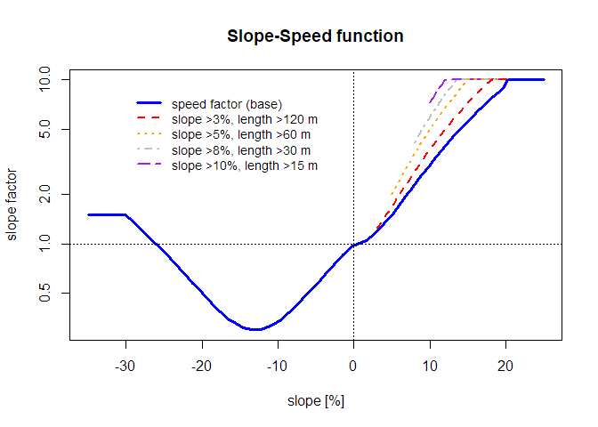
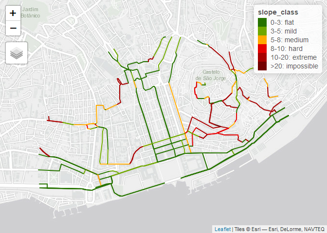
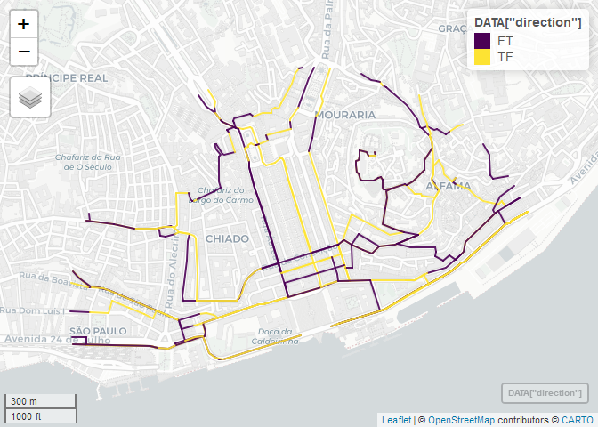
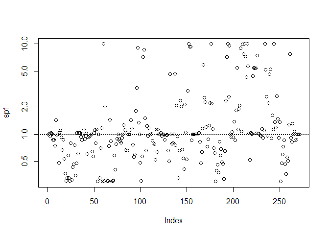
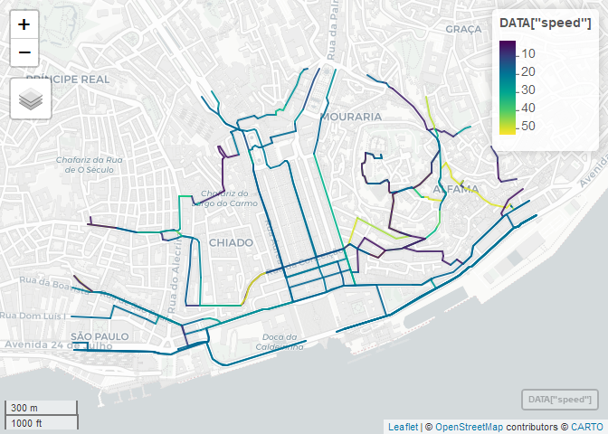
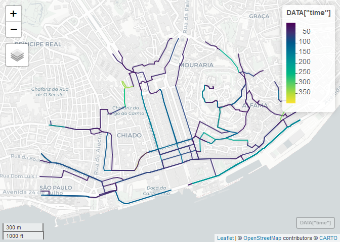

Speed-Slope factor
================
Rosa Félix
06 abril, 2021

## Cost for bicycle routing models

Bicycle routing models add to car routing modeling a greater complexity
that results essentially from the greater number of degrees of freedom
associated with cycling (i.e., a smaller, lighter and more versatile
vehicle in terms of maneuvering) and the fact that it is human powered
and therefore depending on a limited energy, thus depending on the
effort that is transmitted by the cyclist himself. This results in a
series of specific peculiarities in its riding, namely: a greater number
of variables relevant to the routing cost function, and the existence of
more subjective variables.

A complexity involved in modeling route choice for cyclists represents a
challenge. Even if we understand which variables are determinant for
route choice, models become more accurate if it incorporates the
versatility of the bicycle in urban context, and its ability to
circulate in non-road spaces.

GIS allows modeling a road network in the form of a topological graph,
to which a series of functions and algorithms, including the least cost
path ([Dijkstra 1959](#ref-dijkstra1959)). The application of the least
cost path algorithm assumes the existence of a graph formed by a set of
set of edges and nodes. The edges can be oriented or not and, to these,
a travel cost is associated, with one or more parameters, never less
than zero. Associating a travel cost to each arc in the network, the
route cost is defined as the sum of the costs of the arcs that compose
it.

### Speed

For a **constant** urban cycling speed travel (*factor = 1*), let’s say
15 km/h, we assume that the speed is linear to the edge extension, and
its cost is its travel time.

![ c\_{speed} = \\frac{length\_{\[m\]}}{speed\_{\[m/s\]}} = time\_{\[s\]}\\tag{Eq.1}](https://latex.codecogs.com/png.latex?%20c_%7Bspeed%7D%20%3D%20%5Cfrac%7Blength_%7B%5Bm%5D%7D%7D%7Bspeed_%7B%5Bm%2Fs%5D%7D%7D%20%3D%20time_%7B%5Bs%5D%7D%5Ctag%7BEq.1%7D " c_{speed} = \frac{length_{[m]}}{speed_{[m/s]}} = time_{[s]}\tag{Eq.1}")

Many factors may be determinant for **cycling speed**, such the surface
conditions, traffic, weather, mass, type of bicycle, directness,
confidence, etc ([Hochmair 2007](#ref-hochmair2007); [Félix
2012](#ref-Felix2012); [Broach, Dill, and Gliebe 2012](#ref-broach2012);
[Broach 2016](#ref-broach2016)). Here we will look only to **speed
related with gradient**, from the perspective of a common urban cyclist.

### Slope or gradient

When comes to cycling, the route gradient can be a determinant variable
to chose a route instead of an alternative. It is commonly known that
cyclists are averse to roads with an ascending gradient, and that
cyclists prefer roads with a descending gradient. The **direction** of
the gradient is determinant.

It is also known, by the gravity laws, that an object traveling at a
constant speed, its speed becomes faster when going down the hill, and
slower when going uphill. Buy how does it applies to a human behavior?
How does it varies when effort, fear, stamina, and reward plays a role?
When does a cyclist use the break levers? When does a cyclist slows her
pace?

The slope enters the cost function as a proxy for cyclist effort - the
amount of energy a cyclist must expend to travel on a street with a
given slope - causing the traversing time to increase for uphill routes.
On downhill routes, the effort is reduced and the theoretical speed is
increased, reducing their traversing time.

[Scott](#ref-scott2020) ([2020](#ref-scott2020)) designed an experiment
for hiking, and applied a rule saying "*A 10% grade incline cuts your
speed in half"**.*** In their results, they suggested an equation to
calculate uphill speed (for hiking):

}\tag{Eq.2}
")

Which results that with a grade of 20%, one can walk at a speed of 1.78
km/h it her horizontal speed was 4 km/h. When applying to cycling, for a
flat speed of 15km/h, the same incline would be ride at a 6.74 km/h
speed, which is not reliable for a standard cyclist.

Also, the extension of the road segment enters in the cost function: for
longer segments at a given gradient, the effort of the cyclist is higher
than for a shorter segment with the same gradient.

Figure 1 shows the maximum lengths of uphill gradient acceptable to
cyclists ([Austroads 2009](#ref-austroads2009)). It considers that over
a 3% slope, the length should be taken into account.


Sometimes it is more efficient to travel a longer distance with less
steep gradients rather than a shorter distance on a steep gradient.
Other times the extra distance to ride to overcome the gradient is not
so worthwhile and the cyclist chooses to ride up the steeper gradient by
hand. The maximum crossing cost penalty was considered to be 10 times
for this situation, i.e. for edges with a gradient greater than 20%.

Very steep roads are a problem not only for uphill riding, but also for
downhill riding, because a mechanical failure in the brakes can lead to
a dangerous situation for the rider, who also has to expend some effort
and skill to keep the bike balanced and control the additional risk.

<figure>
<figcaption aria-hidden="true">Fig. 2 - World’s steepest street, with a 35% incline for over 161 meters. Baldwin Street, Dunedin, New Zealand (Photo: Wikipedia)</figcaption>
</figure>

Downhill edges mostly result in benefit to the cyclist, increasing its
speed. However, this is not linear, decreasing from slope values above
13%, and may even slow down the speed (relative to the average flat
speed) it too steep.

## Speed-Slope Factor

After an iterative process, which considered the cyclist effort as a
function of slope abacuses suggested by [AASHTO](#ref-aashto1999)
([1999](#ref-aashto1999)) and [Austroads](#ref-austroads2009)
([2009](#ref-austroads2009)) (p. 41), and also a cost formula developed
by [Price and Entrada/San Juan Inc.](#ref-price2008)
([2008](#ref-price2008)), Eq. 2 presets a function that models the slope
factor based on the slope \[%\] and length \[m\] of each road segment.
This function, which is non-symmetric and non-monotonic, reproduces the
essential characteristics of the slope/effort relationship.

In addition to this function, a second set of criteria is applied (*g*),
which increases the *slope factor* when road segments have a given
length \[m\] and slope \[%\], with intervals as suggested by [CEAP -
Centro de Estudos de Arquitectura
Paisagista](#ref-ceap-centrodeestudosdearquitecturapaisagista)
([n.d.](#ref-ceap-centrodeestudosdearquitecturapaisagista)) . Eq.3 shows
that edges with gradient between 0 and 20 in the upward direction are
thus penalized by accumulation of effort.

} = \begin{cases} 1.5 &\Leftarrow \quad slope <-30 \\
1+ 2\frac{0.7}{13} * slope +\frac{0.7}{13^2}*slope^2 &\Leftarrow -30 \leq slope <0 \\
1+ (\frac{slope}{g_{(slope, length)}})^2 &\Leftarrow 0 \leq slope \leq20 \\
10 &\Leftarrow 20 <slope 
\end{cases}\tag{Eq.2} ")

With,

} = \begin{cases} 4 &\Leftarrow 10<slope \leq 13 \quad\wedge\quad  length > 15\\
4.5 &\Leftarrow 8 <slope \leq 10 \quad\wedge\quad  length > 30 \\
5 &\Leftarrow 5 <slope \leq 8 \quad\wedge\quad  length > 60 \\
6 &\Leftarrow 3 <slope \leq 5 \quad\wedge\quad  length > 120 \\
7 &\Leftarrow otherwise 
\end{cases}\tag{Eq.3} ")

As the max penalization going uphill should not be 10 times more than
the flat speed, we add another condition to maximize the **slope
factor**, as follows:

}adjst = \begin{cases} 
10 &\Leftarrow slope >13 \quad\wedge\quad  length >15 \\
10 &\Leftarrow slope >10 \quad\wedge\quad  length >30 \\
10 &\Leftarrow slope >8 \quad\wedge\quad  length >60 \\
10 &\Leftarrow slope >5 \quad\wedge\quad  length >120 \\
\end{cases}\tag{Eq.4} ")

<!-- $$slopefactor_{(slope,length)} > 10 \Rightarrow slope factor_{(slope,length)}adjst = 10 \tag{Eq.4} $$-->

This functions result in a speed factor (in *log* scale) that varies as
this:

<!-- -->

And, finally, we divide the constant flat speed by the *slope factor* as
:


### What does it means uphill?

When going **uphill**, speed will reduce, and longer the road segments,
higher the denominator, and slower the cyclist speed.

For instance, if assuming a constant flat speed of 15 km/h and a road
with 80 m and 3% uphill, a cyclist will reduce to 12.67 km/h

``` r
speedflat = 15
slope = 3
length = 50
speedflat / speedfactor(slope, length, g = g(slope, length))
```

    ## [1] 12.67241

If it is slightly steeper, with 4% uphill, a cyclist will reduce to
11.31 km/h

``` r
slope = 4
length = 50
speedflat / speedfactor(slope, length, g = g(slope, length))
```

    ## [1] 11.30769

If that same segment is longer, a cyclist will reduce to 10.38 km/h

``` r
slope = 4
length = 150
speedflat / speedfactor(slope, length, g = g(slope, length))
```

    ## [1] 10.38462

For higher gradients, the speed decreases with more sensitivity
regarding the segment length.

``` r
slope = 6
length = 60
speedflat / speedfactor(slope, length, g = g(slope, length))
```

    ## [1] 8.647059

``` r
slope = 6
length = 80
speedflat / speedfactor(slope, length, g = g(slope, length))
```

    ## [1] 6.147541

And for very steep streets, cycling speed may reduce to walking speed.

``` r
slope = 9
length = 40
speedflat / speedfactor(slope, length, g = g(slope, length))
```

    ## [1] 3

### And downhill?

In another hand, when going **downhill**, speeds will increase until it
gets 3.33 times faster, when the gradient is 13%. For steeper gradients,
the cyclist will tend to break, and the speed will be lower.

Until the moment when it gets so scary to ride it (again, for a regular
urban cyclist with mild experience), that it will take more time to
travel that road than if it was flat.

``` r
length = 100
slope = -8
speedflat / speedfactor(slope, length, g = g(slope, length))
```

    ## [1] 37.17009

``` r
slope = -13
speedflat / speedfactor(slope, length, g = g(slope, length))
```

    ## [1] 50

``` r
slope = -20
speedflat / speedfactor(slope, length, g = g(slope, length))
```

    ## [1] 29.82353

``` r
slope = -25
speedflat / speedfactor(slope, length, g = g(slope, length))
```

    ## [1] 16.73267

``` r
slope = -30
speedflat / speedfactor(slope, length, g = g(slope, length))
```

    ## [1] 10.01976

## Case Study

``` r
#use example from slopes()
DATA = slopes::lisbon_road_segments
DATA$slope = slope_raster(DATA, dem = dem_lisbon_raster)
DATA$slope = 100*DATA$slope
DATA$slope_class = DATA$slope %>% 
  cut(
    breaks = c(0, 3, 5, 8, 10, 20, Inf),
    labels = c("0-3: flat", "3-5: mild", "5-8: medium", "8-10: hard", "10-20: extreme", ">20: impossible"),
    right = F
  )
palredgreen = c("#267300", "#70A800", "#FFAA00", "#E60000", "#A80000", "#730000")
tmap_mode("view")
```

    ## tmap mode set to interactive viewing

``` r
tm_shape(DATA) +
  tm_lines(
    col = "slope_class",
    palette = palredgreen, #palete de cores
    lwd = 2,
    id = "slope") #espessura das linhas
```

<!-- -->

``` r
DATA$length = st_length(DATA)


#assign a direction of slope, for the purpose of the example
DATA$direction = "FT"
DATA$direction[(DATA$z0 - DATA$z1) < 0] = "TF"

mapviewOptions(fgb = FALSE)
mapview::mapview(DATA["direction"],  selfcontained=TRUE)
```

<!-- -->

``` r
DATA$slope[DATA$direction == "TF"] = -(DATA$slope[DATA$direction == "TF"])
slope = DATA$slope
length = units::drop_units(DATA$length)
g = g(slope, length)

spf = speedfactor(slope, length, g)

plot(spf, log="y")
abline(h = 1, lty = 3)
```

<!-- -->

``` r
DATA$speedfactor = spf


#set speed
speedflat = 16 #set here in km/h (convert to m/s: speed/3.6)

DATA$speed = speedflat / DATA$speedfactor
DATA$time = length / DATA$speed*3.6

mapview::mapview(DATA["speed"])
```

<!-- -->

``` r
mapview::mapview(DATA["time"])
```

<!-- -->

This is a work in progress. **Suggestions and comments are welcome**! :)
[github.com/U-Shift/Declives-RedeViaria/tree/main/SpeedSlopeFactor](https://github.com/U-Shift/Declives-RedeViaria/tree/main/SpeedSlopeFactor)

## References

<div id="refs" class="references csl-bib-body hanging-indent">

<div id="ref-aashto1999" class="csl-entry">

AASHTO. 1999. *Guide for the Development of Bicycle Facilities*.
Washington, DC: American Association of State Highway; Transportation
Officials. <http://safety.fhwa.dot.gov/ped_bike/docs/b_aashtobik.pdf>.

</div>

<div id="ref-austroads2009" class="csl-entry">

Austroads. 2009. “Part 6a: Pedestrian and Cyclist Paths.” In. Austroads.

</div>

<div id="ref-broach2016" class="csl-entry">

Broach, Joseph. 2016. “Travel Mode Choice Framework Incorporating
Realistic Bike and Walk Routes.” PhD thesis.

</div>

<div id="ref-broach2012" class="csl-entry">

Broach, Joseph, Jennifer Dill, and John Gliebe. 2012. “Where Do Cyclists
Ride? A Route Choice Model Developed with Revealed Preference GPS Data.”
*Transportation Research Part A: Policy and Practice* 46 (10): 1730–40.
<https://doi.org/10.1016/j.tra.2012.07.005>.

</div>

<div id="ref-ceap-centrodeestudosdearquitecturapaisagista"
class="csl-entry">

CEAP - Centro de Estudos de Arquitectura Paisagista. n.d. “Contributos
Para o Regulamento de Percursos Cicláveis Em Portugal.”

</div>

<div id="ref-dijkstra1959" class="csl-entry">

Dijkstra, E. W. 1959. “A Note on Two Problems in Connexion with Graphs.”
*Numerische Mathematik* 1 (1): 269–71.
<https://doi.org/10.1007/bf01386390>.

</div>

<div id="ref-Felix2012" class="csl-entry">

Félix, Rosa. 2012. “Gestão Da Mobilidade Em Bicicleta: Necessidades,
Factores de Preferência e Ferramentas de Suporte Ao Planeamento e Gestão
de Redes. O Caso de Lisboa.” Master’s thesis, Instituto Superior
Técnico; University of Lisbon.
<https://fenix.tecnico.ulisboa.pt/downloadFile/395144993029/GestaoMobilidadeBicicleta_RosaFelix_IST2012.pdf>.

</div>

<div id="ref-hochmair2007" class="csl-entry">

Hochmair, Hartwig. 2007. “Optimal Route Selection with Route Planners:
Results of a Desktop Usability Study.” In, 5–8. Seattle, Washington: ACM
GIS.

</div>

<div id="ref-price2008" class="csl-entry">

Price, Mike, and Entrada/San Juan Inc. 2008. “Slopes , Sharp Turns , and
Speed: Refining Emergency Response Networks to Accommodate Steep Slopes
and Turn Rules.” *Hands On - ArcUser Spring 2008* 11 (2): 50–57.

</div>

<div id="ref-scott2020" class="csl-entry">

Scott, Adam. 2020. “Moving Uphill, a 10.” *Mountain Tactical Institute*.
<https://mtntactical.com/research/walking-uphill-10-grade-cuts-speed-13not-12/>.

</div>

</div>
